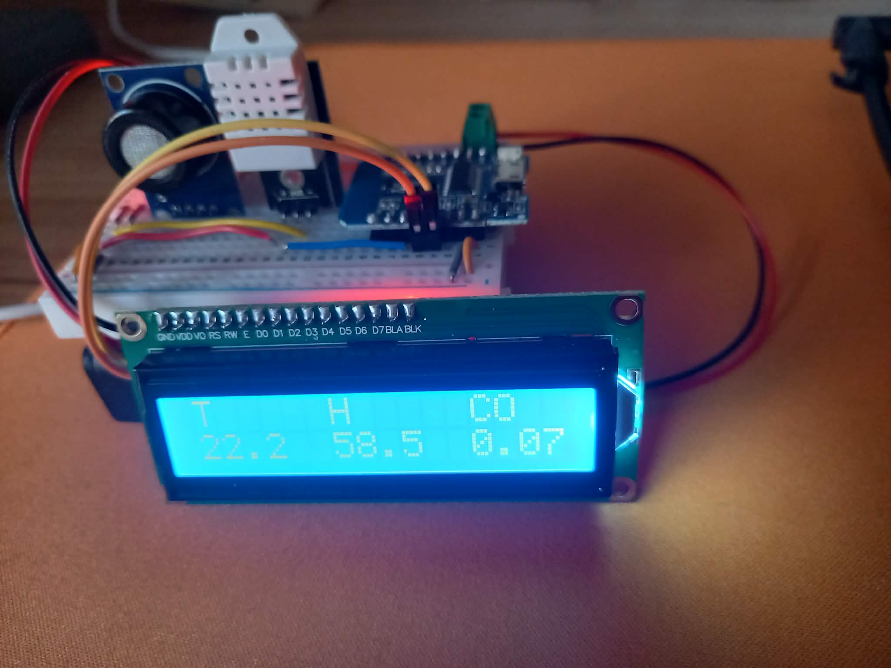

# Air Analysis Station

This is an MCU-driven station for the air quality analysis. It measures temperature, relative humidity, and indirect concetration of CO in the air.

## Components
- WeMos D1 Mini ESP8266 MCU : main computing unit
- 400 pin breadboard : non-soldiering alternative to PCB for prototyping
- DHT22 sensor : temperature and humidity measurements (contains a small chip for digital communication and value computation)
- MQ-7 sensor : CO2 sensing unit with analog output based on CO concentration
- LCD display (16x2 symbols) with controller and I2C communication device (to reduce number of pins needed)
- Jumper wires, copper conductors, 4x1.5V AA bateries, battery holder

## Software requirements

The firmware for the MCU was written in C++ using Arduino libraries for ESP8266. Beyond the core libraries, I used:
- `DHTesp` library for communication with DHT22 (proprietary one-wire like protocol)
- `LiquidCrystal` library for I2C communicaton with LCD display

